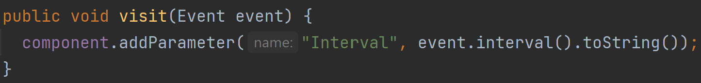
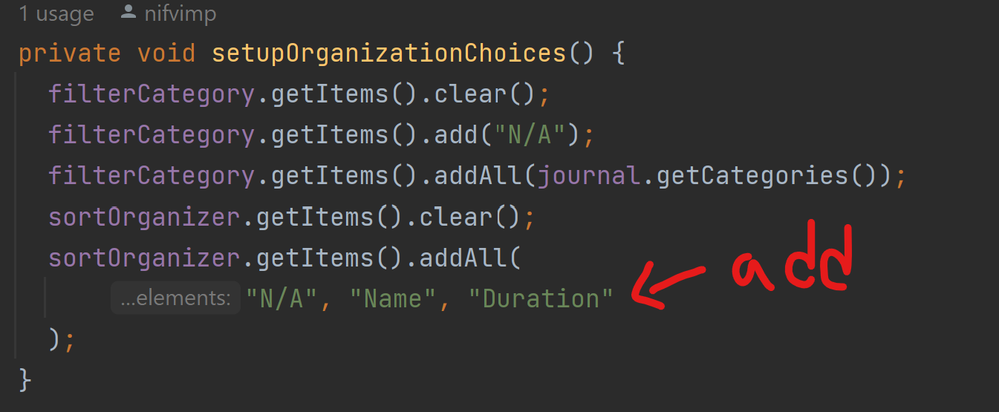
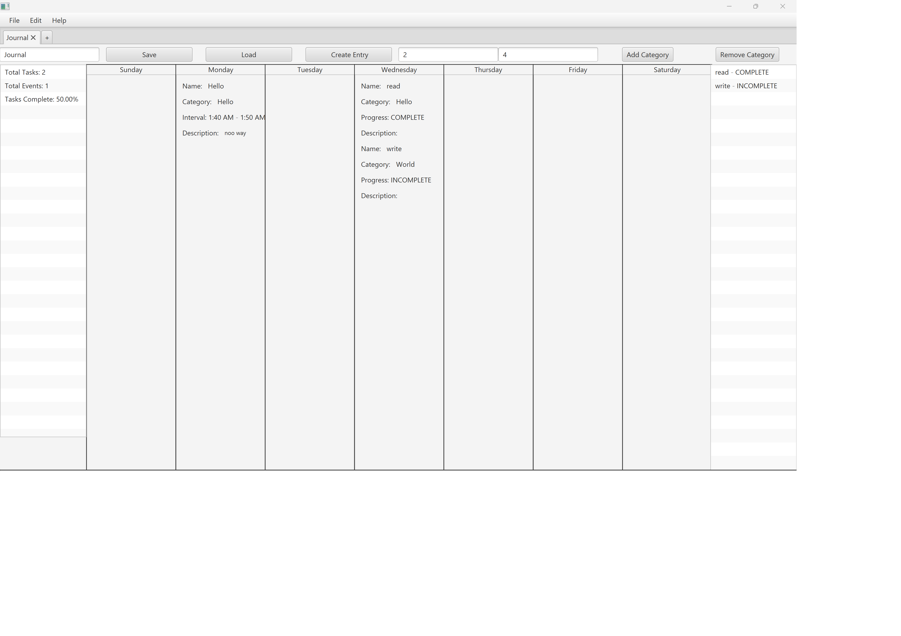
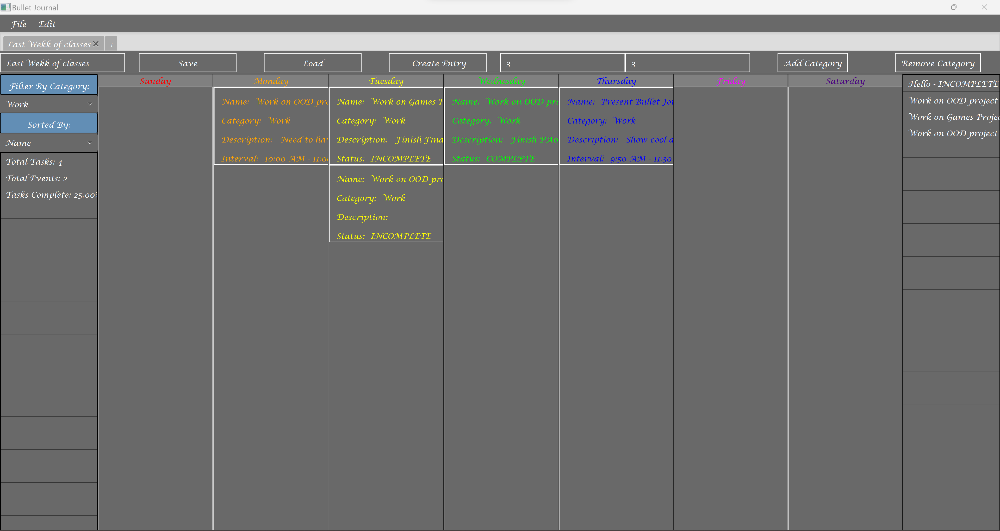

[PA Write Up](https://markefontenot.notion.site/PA-05-8263d28a81a7473d8372c6579abd6481)
# 3500 PA05 Project Repo

## Elevator Pitch
Take a look at the night agenda, the useful agenda that helps Computer Science coders keep track of goals. With the
agenda, users have the abilities to open multiple tabs to represent different weeks, create task and events and assign
completion or time duration status to them. It also comes with a list on both sides one to keep track of the number of
task and events on the left and the other to show completed or uncompleted tasks on the right to make sure you are on
track. Set an event for the wrong day or need to change something about it? No worry all you have to do is click on the
event, and you can change its properties, plus you can save or load different bujo files for different weeks. Even more
within so go ahead and give it a download to keep track of your coding tasks in a nice, convenient planner!
## Example of Solid Principle

## Extensibility
The display of entries inside the main week view of the application, and the sorting and filtering
functionality of the application is very extensible. 

Through the use of the visitor pattern we have enabled the addition and display of new types of 
entries that extend the abstract entry class by modifying the EntryVisitor interface to support 
the new subclass (adding a visit(subclass) method) and implementing the new interface method with 
code that can optionally add parameters to the display specific to the new subclass.

The mini-view window and new entry creation dialog, however, does not support this sort extension.

We also have the EntryOrganizer interface that is available for extension to easily implement new
filtering and sorting options. The model supports getting the list and map of entries organized 
by the EntryOrganizer implementations passed into the getter function. The view controller also
supports new implementations of EntryOrganizer in it's 'sort by:' dropdown when paired along with
some slight modifications to the function that handles that sorting in the view.
To fully support the new EntryOrganizer in the GUI application you have to add a bit here as well
a few other minor changes if you want to include filtering:

## Running Executable Jar
1. run gradle build
2. run the [built fatJar](build/fatJar/pa05-waht.jar)
## GUI Alpha Release

## GUI Beta Release
