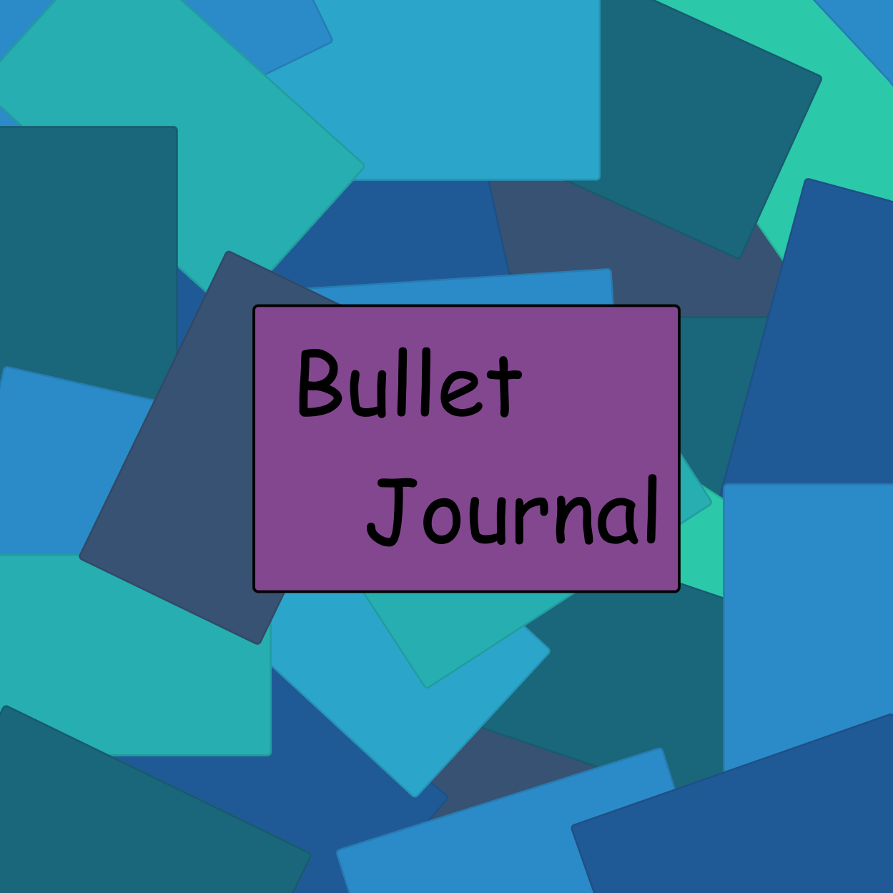

[PA Write Up](https://markefontenot.notion.site/PA-05-8263d28a81a7473d8372c6579abd6481)
# 3500 PA05 Project Repo
## Elevator Pitch
Take a look at the night agenda, the useful agenda that helps Computer Science coders keep track of goals. With the
agenda, users have the abilities to open multiple tabs to represent different weeks, create task and events and assign
completion or time duration status to them. It also comes with a list on both sides one to keep track of the number of
task and events on the left and the other to show completed or uncompleted tasks on the right to make sure you are on
track. Set an event for the wrong day or need to change something about it? No worry all you have to do is click on the
event, and you can change its properties, plus you can save or load different bujo files for different weeks. Even more
within so go ahead and give it a download to keep track of your coding tasks in a nice, convenient planner!
## Example of Solid Principle
### Single Responsibility
As we wrote our code, we did our best to adhere to the Single Responsibility Principle by making our classes and our
methods in a way such that they have one purpose. A good example of where we did this in our code is our view classes.
Our view classes ApplicationView and SplashView both exist for the single purpose of showing loading their respective
scenes/views. They do not handle the logic of the stage and the scene in the view, but simply load what needs to be.

### Open / Closed
We have a lot of examples of our code being open to extension and closed to modification in our model. We have
interfaces and abstract classes that leave our code to be easily extendable, without changing those classes. One
example of this is our EntryOrganizer interface. The interface provides a foundation that we build upon in our other
classes that implement it. Some examples of this are FilterByCategory, FilterEvent, FilterTask,
SortByDay, SortByDuration, and SortByName. We have already expanded upon the interface a fair bit, and still have room
to add more in the future.

### Liskov Substitution
The main place we applied the Liskov Substitution Principle is regarding our Entry class and the classes that implement
it. For our Entry class, any type extending it should be able to be passed in to any method expecting an Entry.
One example of this can be seen in our BulletJournal class, which have both an addEntry and an removeEntry method that
take in an Entry. We can pass in either a Task or an Event into the methods, or any future Entry we may create.
Some other examples of classes that have methods that work the same way include Day and Week.

### Interface Segregation
We made sure to apply the Interface Segregation Principle as we made our interfaces in our application. A good example
of the principle in our code is with our EntryOrganizer. The interface only has the base functionality that any class
implementing EntryOrganizer should certainly do. These two methods are organize and type. These methods are needed
since all classes implementing EntryOrganizer are doing so with the purpose of organizing, and the type is always
needed for identifying the type(s) of sort being done. Other methods more specific to the sorters implementing 
EntryOrganizer such as category, status, and compare are not in the interface as they are not methods that all the
classes will need.

### Dependency Inversion
In order to follow the Dependency Inversion Principle, we made sure we made good use of interfaces and abstract classes.
This can be seen through interfaces such as EntryOrganizer, and abstract classes such as Entry. We follow the principle
by having our lower level classes such as Task, Event, and the filters rely on the interfaces and abstract classes which
are then in turn are used by the higher level classes. 

## Extensibility
The display of entries inside the main week view of the application, and the sorting and filtering
functionality of the application is very extensible. 

Through the use of the visitor pattern we have enabled the addition and display of new types of 
entries that extend the abstract entry class by modifying the EntryVisitor interface to support 
the new subclass (adding a visit(subclass) method) and implementing the new interface method with 
code that can optionally add parameters to the display specific to the new subclass.

The mini-view window and new entry creation dialog, however, does not support this sort extension.

We also have the EntryOrganizer interface that is available for extension to easily implement new
filtering and sorting options. The model supports getting the list and map of entries organized 
by the EntryOrganizer implementations passed into the getter function. The view controller also
supports new implementations of EntryOrganizer in it's 'sort by:' dropdown when paired along with
some slight modifications to the function that handles that sorting in the view.
To fully support the new EntryOrganizer in the GUI application you have to add a bit here as well
a few other minor changes if you want to include filtering:

## Running Executable Jar
1. run gradle build
2. run the [built fatJar](build/fatJar/pa05-waht.jar)
## GUI Beta Release
### GUI Journal View

### GUI Splash

### GUI PopUP

## GUI Alpha Release

## Image Attributions
- Save Icon: https://encrypted-tbn0.gstatic.com/images?q=tbn:ANd9GcQeOuuO0-M6rG7Ay_S3-3uyYyn6fzVKW3T4LQ4JpmDPag&s
- Delete Icon: https://www.google.com/url?sa=i&url=https%3A%2F%2Fwww.iconsdb.com%2Fwhite-icons%2Fdelete-icon.html&psig=AOvVaw08vgTolURWpeRNV_9uyhqa&ust=1687485112020000&source=images&cd=vfe&ved=0CBAQjRxqFwoTCMi1rYfi1f8CFQAAAAAdAAAAABAE
- Create Icon: https://www.google.com/url?sa=i&url=https%3A%2F%2Fwww.vectorstock.com%2Froyalty-free-vector%2Fcreate-flat-white-color-icon-vector-6076421&psig=AOvVaw10jfv-7ZHVTzE2Zcx-AaMF&ust=1687484999770000&source=images&cd=vfe&ved=0CBAQjRxqFwoTCLix49Hh1f8CFQAAAAAdAAAAABAE
- Cancel Icon: https://www.google.com/url?sa=i&url=https%3A%2F%2Fwww.iconsdb.com%2Fwhite-icons%2Fcancel-icon.html&psig=AOvVaw16VRl2nb1-TqmqlfFR70pK&ust=1687485141372000&source=images&cd=vfe&ved=0CBAQjRxqFwoTCJDEoJXi1f8CFQAAAAAdAAAAABAE